# Pipedrive B2B Sales CRM Implementation

## Nexora B2B Sales Operations

> **End-to-end Pipedrive CRM implementation covering B2B pipeline design, prospect management, sales qualification, activity management, workflow automation, forecasting, reporting, revenue goals, and product management.**

**Platform:** Pipedrive CRM  
**Business:** Nexora — Fictional B2B Technology & Automation Company  
**Project Type:** CRM Implementation | Sales Operations | Workflow Automation  
**Created by:** Chika Blessing

---

# 📌 Project Snapshot

Nexora needed more than a database of contacts.

The objective of this project was to design a structured B2B sales environment where the team could manage prospects, qualify opportunities, maintain clear next actions, automate repetitive follow-up, monitor pipeline movement, and give management visibility into sales performance.

### The solution connects:

**Pipeline → Organizations → Decision Makers → Deals → Qualification → Activities → Automations → Analytics → Goals → Products**

---

# 01 | Sales Pipeline Architecture

The implementation began by designing a dedicated **Nexora B2B Sales Pipeline** around the company's pre-sales lifecycle.

<p align="center">
  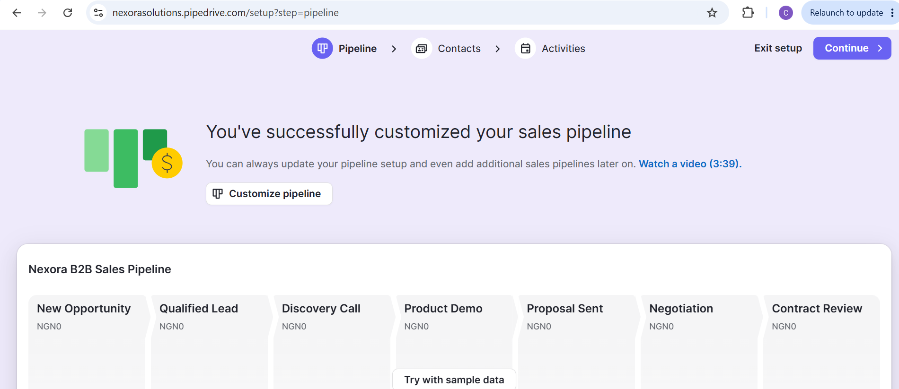
</p>

<p align="center"><em>Custom Nexora B2B Sales Pipeline configured in Pipedrive.</em></p>

### Pipeline Stages

| Stage | Purpose |
|---|---|
| **New Opportunity** | Capture a newly identified sales opportunity |
| **Qualified Lead** | Confirm sufficient fit and commercial potential |
| **Discovery Call** | Understand requirements, pain points and stakeholders |
| **Product Demo** | Demonstrate the relevant Nexora solution |
| **Proposal Sent** | Present the proposed commercial solution |
| **Negotiation** | Resolve commercial and solution requirements |
| **Contract Review** | Complete final contractual review |
| **Won** | Record successful closure |

The pipeline establishes a consistent path for moving opportunities from initial interest toward revenue.

---

# 02 | Account & Contact Management

With the sales process established, prospect organizations and their decision makers were added to the CRM.

<table>
<tr>
<td width="50%" valign="top">

<h3>🏢 Prospect Organizations</h3>

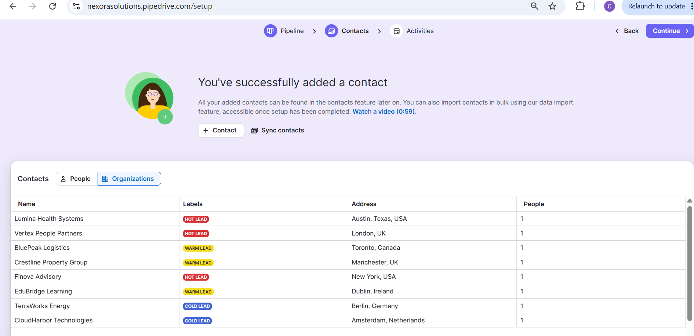

<p><em>Target B2B organizations classified using Hot, Warm and Cold lead labels.</em></p>

</td>
<td width="50%" valign="top">

<h3>👤 Decision Makers</h3>

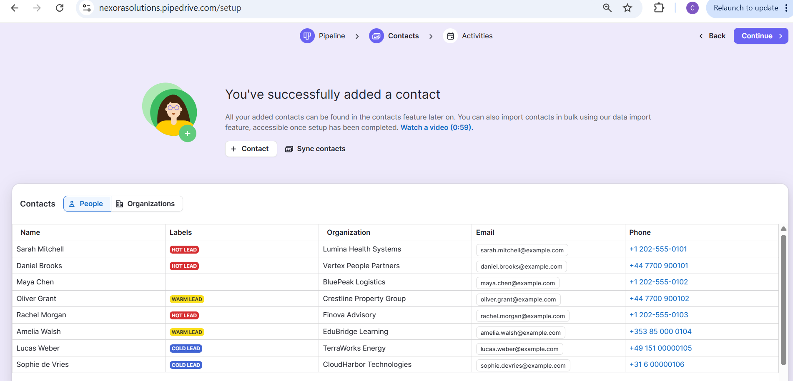

<p><em>Decision makers linked to their respective prospect organizations.</em></p>

</td>
</tr>
</table>

The sample account portfolio represents prospects across healthcare, HR, logistics, property, financial services, education, energy and technology.

Contact records centralize:

**Name · Lead Classification · Organization · Email · Phone**

This connects the **company being pursued** with the **person involved in the buying decision**.

---

# 03 | Opportunity Management

Once the CRM foundation was established, realistic sample opportunities were created and distributed across the sales lifecycle.

<p align="center">
  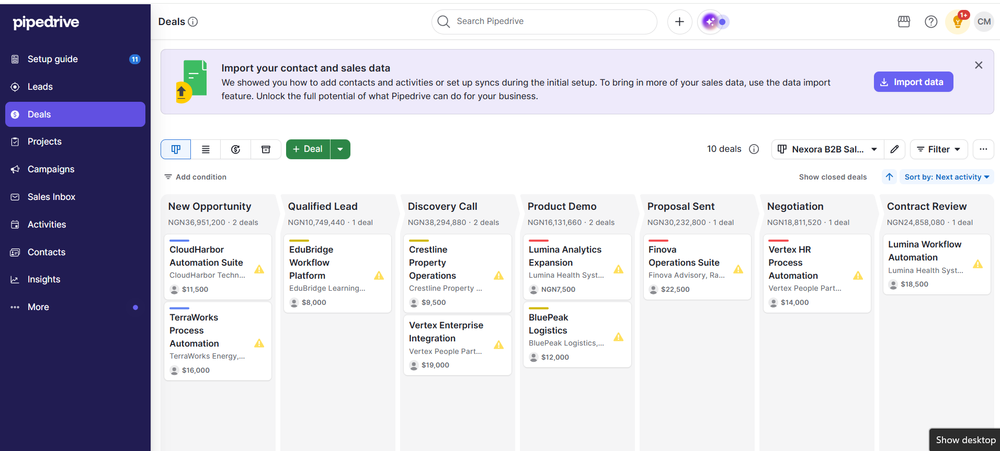
</p>

<p align="center"><em>Populated Nexora B2B Sales Pipeline showing active opportunities at different stages.</em></p>

### The working pipeline provides visibility into:

- Current opportunities
- Pipeline position
- Deal value
- Account relationships
- Opportunity distribution
- Next-action requirements

This transforms the original pipeline architecture into a functioning sales workspace.

---

# 04 | Sales Qualification Framework

A deal value alone does not tell a salesperson whether an opportunity is genuinely qualified.

Custom deal fields were configured to capture the information required for better B2B sales decisions.

<table>
<tr>
<td width="50%" valign="top">

<h3>⚙️ Qualification Fields</h3>

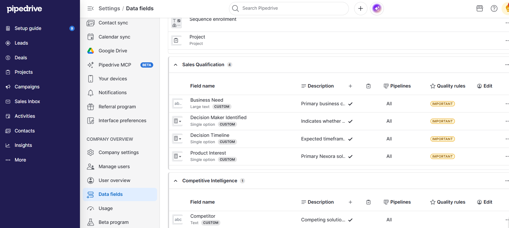

<p><em>Custom sales qualification and competitive-intelligence fields.</em></p>

</td>
<td width="50%" valign="top">

<h3>🎯 Qualification in Practice</h3>

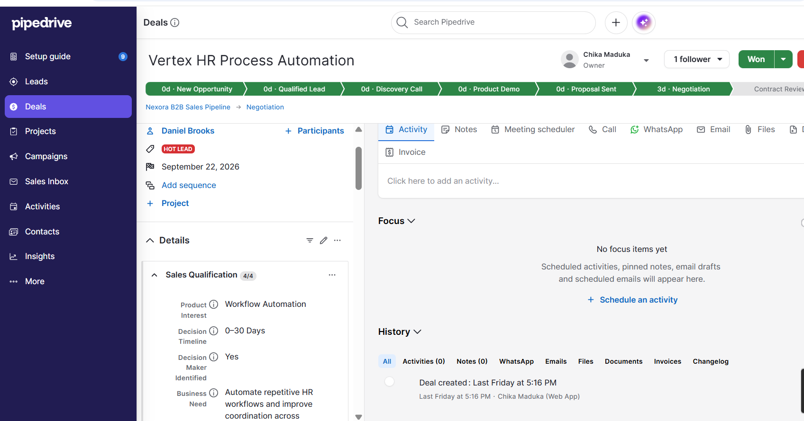

<p><em>Qualification information captured directly within an active opportunity.</em></p>

</td>
</tr>
</table>

### Qualification Logic

| Business Question | CRM Field |
|---|---|
| What does the prospect need? | **Business Need** |
| What solution are they interested in? | **Product Interest** |
| Is the buying authority known? | **Decision Maker Identified** |
| When is a decision expected? | **Decision Timeline** |
| Who else may be competing? | **Competitor** |

This creates a more disciplined qualification process before opportunities progress deeper into the pipeline.

---

# 05 | Sales Activity Management

The CRM was configured to manage the actions required to keep opportunities moving.

<p align="center">
  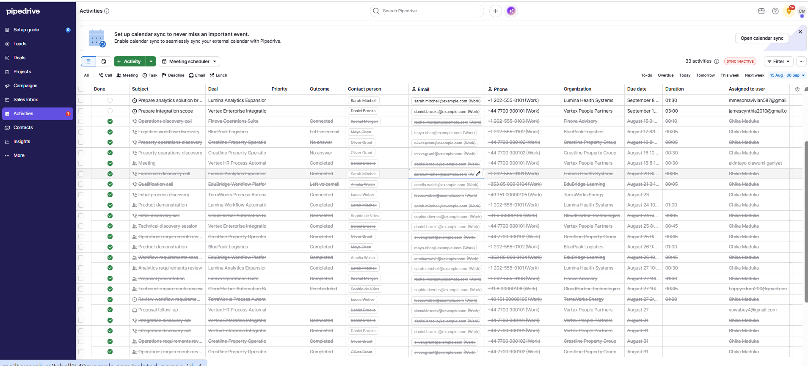
</p>

<p align="center"><em>Centralized team activity management across Nexora sales opportunities.</em></p>

Activities include:

**Qualification Calls · Discovery Meetings · Requirements Sessions · Product Demonstrations · Proposal Follow-Ups · Technical Reviews · Negotiation Follow-Ups · Contract Actions**

> ### Every active opportunity should have a meaningful next action.

Instead of relying on memory or disconnected reminders, the sales team can manage completed and upcoming work alongside the opportunity itself.

---

# 06 | Workflow Automation

The next layer reduces repetitive CRM administration by automatically creating appropriate follow-up activities at important stages.

<table>
<tr>
<td width="50%" valign="top">

<h3>⚡ New Opportunity Qualification</h3>

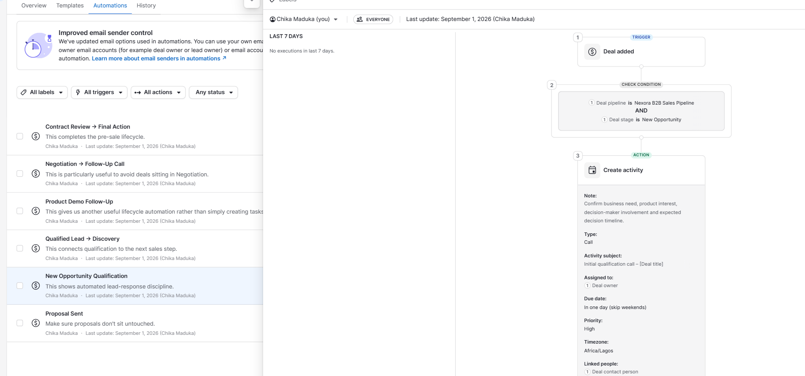

<p><em>New opportunities trigger an initial qualification activity for the deal owner.</em></p>

</td>
<td width="50%" valign="top">

<h3>🔎 Qualified Lead → Discovery</h3>

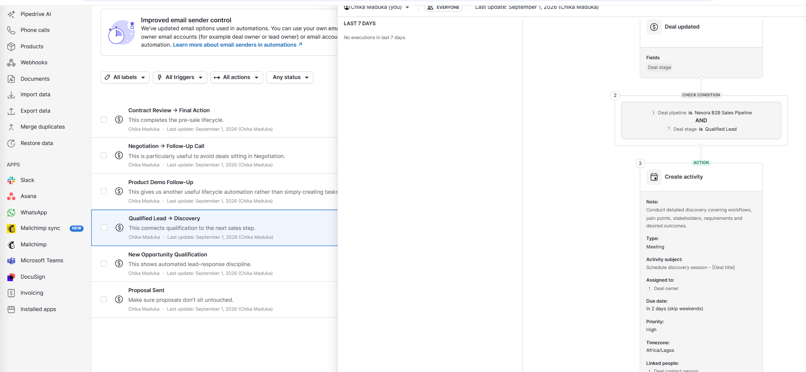

<p><em>Qualified opportunities automatically progress into a structured discovery action.</em></p>

</td>
</tr>
</table>

### Automation Pattern

**Deal Event → Check Pipeline/Stage → Create Next Activity**

The qualification workflow prompts the salesperson to confirm business need, product interest, decision-maker involvement and expected decision timeline.

The discovery workflow then moves the conversation toward workflows, pain points, stakeholders, requirements and desired outcomes.

---

## Six Active Lifecycle Automations

<p align="center">
  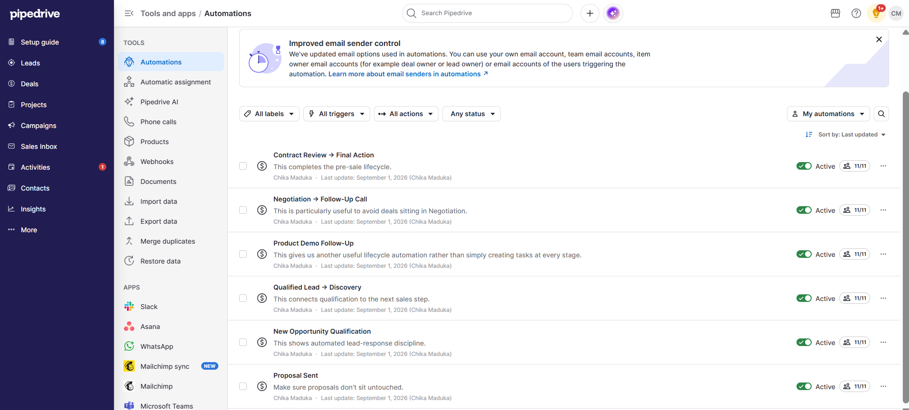
</p>

<p align="center"><em>Automation suite supporting Nexora's pre-sales lifecycle.</em></p>

| # | Automation | Purpose |
|---|---|---|
| 01 | **New Opportunity Qualification** | Establish immediate qualification |
| 02 | **Qualified Lead → Discovery** | Connect qualification to discovery |
| 03 | **Product Demo Follow-Up** | Maintain momentum after demonstrations |
| 04 | **Proposal Sent Follow-Up** | Prevent proposals from sitting untouched |
| 05 | **Negotiation → Follow-Up Call** | Maintain momentum during negotiation |
| 06 | **Contract Review → Final Action** | Support the final pre-sale stage |

### Automation Value

✓ Reduces forgotten follow-ups  
✓ Standardizes sales execution  
✓ Maintains opportunity momentum  
✓ Improves accountability  
✓ Reduces repetitive administrative work

---

# 07 | Forecasting & Pipeline Analytics

The implementation then moves from day-to-day CRM operation into sales intelligence.

<table>
<tr>
<td width="50%" valign="top">

<h3>📈 Expected Close Forecast</h3>

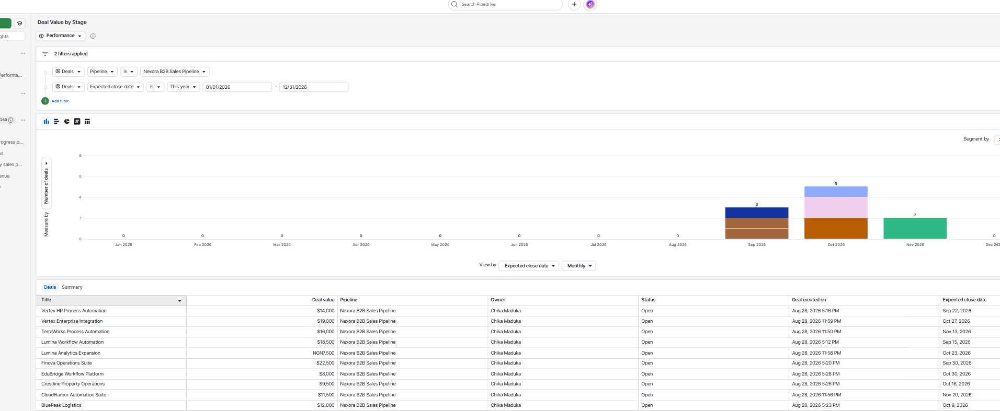

<p><em>Forecast view showing when current Nexora opportunities are expected to close.</em></p>

</td>
<td width="50%" valign="top">

<h3>🔄 Pipeline Movement</h3>

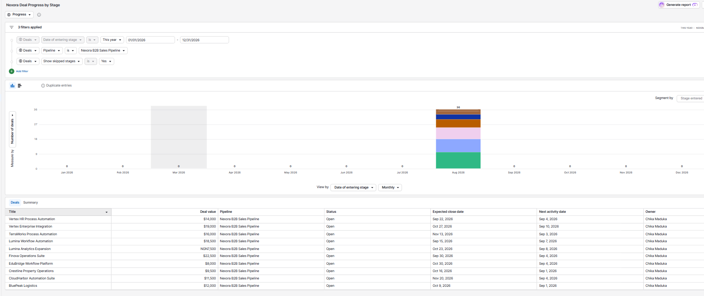

<p><em>Progress reporting showing movement through the B2B sales lifecycle.</em></p>

</td>
</tr>
</table>

The forecast provides visibility into expected closing periods while retaining the underlying deal information.

The progression report adds another perspective by showing **how opportunities have moved through the pipeline**, rather than only where they currently sit.

---

# 08 | Executive Sales Dashboard

Individual reports were consolidated into a dedicated **Nexora Sales Performance Dashboard**.

<p align="center">
  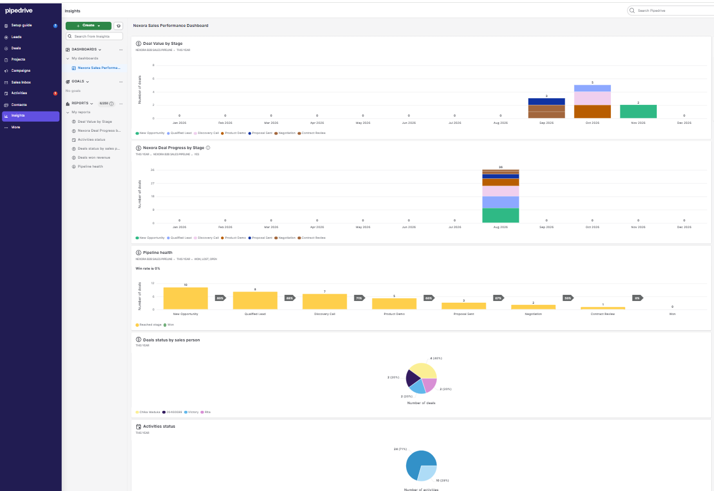
</p>

<p align="center"><em>Executive sales dashboard consolidating pipeline, activity and performance insights.</em></p>

### Management View

| Management Question | Dashboard Insight |
|---|---|
| When are opportunities expected to close? | Deal Value by Stage |
| Are opportunities progressing? | Nexora Deal Progress by Stage |
| Where is the pipeline narrowing? | Pipeline Health |
| How are deals distributed across sales ownership? | Deals Status by Salesperson |
| What is happening with sales activity? | Activities Status |
| What revenue has closed? | Deals Won Revenue |

The dashboard combines different visualization formats so management can understand the sales operation without opening individual deal records.

---

# 09 | Goals & Commercial Structure

The final layer connects sales execution with **performance targets and standardized service offerings**.

<table>
<tr>
<td width="50%" valign="top">

<h3>🎯 Q4 Revenue Goal</h3>

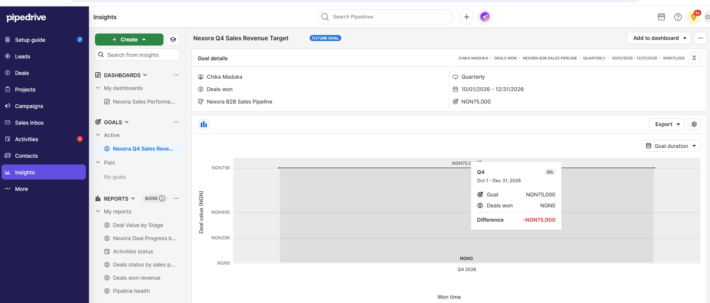

<p><em>Quarterly revenue target connected to deals won in the Nexora pipeline.</em></p>

</td>
<td width="50%" valign="top">

<h3>📦 Service Catalogue</h3>

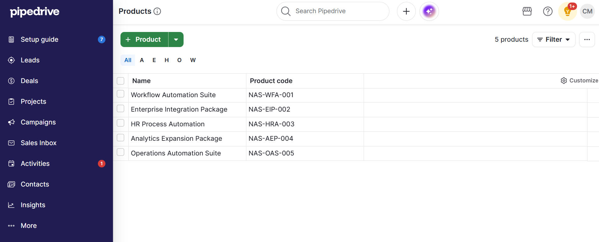

<p><em>Standardized Nexora product and service catalogue with unique product codes.</em></p>

</td>
</tr>
</table>

### Nexora Q4 Sales Revenue Target

| Setting | Configuration |
|---|---|
| Goal Type | Deals Won |
| Pipeline | Nexora B2B Sales Pipeline |
| Frequency | Quarterly |
| Period | Q4 2026 |
| Target | NGN 75,000 |

> **Portfolio Note:** The displayed goal currency reflects the regional/account currency configuration of the Pipedrive environment used for this implementation.

### Product & Service Catalogue

| Product / Service | Product Code |
|---|---|
| Workflow Automation Suite | NAS-WFA-001 |
| Enterprise Integration Package | NAS-EIP-002 |
| HR Process Automation | NAS-HRA-003 |
| Analytics Expansion Package | NAS-AEP-004 |
| Operations Automation Suite | NAS-OAS-005 |

Together, these features connect day-to-day sales execution with measurable performance objectives and standardized commercial offerings.

---

# 🔄 End-to-End Solution

The completed implementation connects the customer journey from prospect identification through sales-performance management.

```text
TARGET ACCOUNT
      ↓
DECISION MAKER
      ↓
NEW OPPORTUNITY
      ↓
QUALIFICATION
      ↓
DISCOVERY
      ↓
PRODUCT DEMO
      ↓
PROPOSAL
      ↓
NEGOTIATION
      ↓
CONTRACT REVIEW
      ↓
WON
      ↓
REVENUE & PERFORMANCE REPORTING
```

### Three supporting layers operate throughout the lifecycle:

| Layer | Purpose |
|---|---|
| **Activities** | Keep opportunities moving |
| **Automations** | Create consistent next actions |
| **Insights & Goals** | Provide management visibility |

---

# 💼 Business Outcome

The completed environment demonstrates how Pipedrive can be developed from an empty CRM into a structured B2B sales-management system.

<table>
<tr>
<td width="50%" valign="top">

<h3>CRM Foundation</h3>

✓ Custom B2B sales pipeline<br>
✓ Prospect organizations<br>
✓ Decision-maker contacts<br>
✓ Structured opportunity records

</td>
<td width="50%" valign="top">

<h3>Sales Execution</h3>

✓ Qualification framework<br>
✓ Centralized activity management<br>
✓ Six lifecycle automations<br>
✓ Defined next-action process

</td>
</tr>

<tr>
<td width="50%" valign="top">

<h3>Management Visibility</h3>

✓ Expected-close forecasting<br>
✓ Pipeline movement analysis<br>
✓ Sales performance dashboard<br>
✓ Pipeline health reporting<br>
✓ Quarterly revenue target

</td>
<td width="50%" valign="top">

<h3>Commercial Structure</h3>

✓ Standardized product catalogue<br>
✓ Consistent service codes<br>
✓ Defined revenue objective<br>
✓ Structured sales lifecycle

</td>
</tr>
</table>

### The result:

> A connected system for **capturing, qualifying, progressing, following up, analyzing and managing B2B sales opportunities.**

---

# 🧩 Implementation at a Glance

| Area | Implementation |
|---|---|
| **Platform** | Pipedrive CRM |
| **Business Model** | B2B Technology Sales |
| **Pipeline** | Nexora B2B Sales Pipeline |
| **Pipeline Stages** | 8 |
| **Sample Opportunities** | 10 |
| **Qualification** | Custom deal fields |
| **Activity Management** | Calls, meetings, tasks & follow-ups |
| **Workflow Automation** | 6 lifecycle automations |
| **Analytics** | Pipeline & sales reports |
| **Dashboard** | Nexora Sales Performance Dashboard |
| **Goal Management** | Quarterly revenue target |
| **Product Management** | 5 standardized services |

---

# 📚 Project Documentation

Detailed implementation documentation is available in the [`documentation`](documentation/) directory.

| Document | Coverage |
|---|---|
| [01 – Project Overview](documentation/01-project-overview.md) | Scope, scenario and objectives |
| [02 – Business Requirements](documentation/02-business-requirements.md) | Requirements and success criteria |
| [03 – Solution Design](documentation/03-solution-design.md) | CRM architecture |
| [04 – Pipeline & Deal Management](documentation/04-pipeline-and-deal-management.md) | Sales lifecycle design |
| [05 – Activity Management](documentation/05-activity-management.md) | Sales activity framework |
| [06 – Workflow Automations](documentation/06-workflow-automations.md) | Automation strategy |
| [07 – Reporting & Dashboard](documentation/07-reporting-and-dashboard.md) | Analytics and management reporting |
| [08 – Sales Goals](documentation/08-sales-goals.md) | Revenue target configuration |
| [09 – Product Catalogue](documentation/09-product-catalogue.md) | Product and service structure |

---

# 🛠️ Skills Demonstrated

`Pipedrive CRM` · `CRM Implementation` · `Sales Operations` · `B2B Sales Process` · `Pipeline Design` · `Deal Management` · `CRM Data Management` · `Sales Qualification` · `Activity Management` · `Workflow Automation` · `Process Design` · `Sales Reporting` · `Dashboard Design` · `Pipeline Analytics` · `Revenue Forecasting` · `Goal Tracking` · `Product Management`

---

# 📂 Repository Structure

```text
pipedrive-b2b-sales-crm-implementation/
│
├── README.md
│
├── documentation/
│   ├── 01-project-overview.md
│   ├── 02-business-requirements.md
│   ├── 03-solution-design.md
│   ├── 04-pipeline-and-deal-management.md
│   ├── 05-activity-management.md
│   ├── 06-workflow-automations.md
│   ├── 07-reporting-and-dashboard.md
│   ├── 08-sales-goals.md
│   └── 09-product-catalogue.md
│
└── screenshots/
    ├── 01-nexora-b2b-sales-pipeline.png
    ├── 02-prospect-organizations.png
    ├── 03-decision-maker-contacts.png
    ├── 04-populated-sales-pipeline.png
    ├── 05-custom-deal-fields.png
    ├── 06-deal-sales-qualification.png
    ├── 07-team-sales-activity-management.png
    ├── 08-new-opportunity-qualification-automation.png
    ├── 09-qualified-lead-discovery-automation.png
    ├── 10-active-sales-automations-overview.png
    ├── 11_Deal_Value_and_Expected_Close_Forecast.png
    ├── 12_Deal_Progress_and_Pipeline_Movement.png
    ├── 13-nexora-sales-performance-dashboard.png
    ├── 14-nexora-q4-sales-revenue-goal.png
    └── 15-nexora-product-service-catalogue.png
```

---

# Project Disclaimer

**Nexora is a fictional company.** The organizations, contacts, opportunities, commercial information and other sample data shown in this project were created for portfolio and demonstration purposes.

This project demonstrates practical CRM implementation and sales-operations skills and does not represent a live client deployment.

---

## 👤 Created by Chika Blessing

**Executive Business Partner | Success Partner | Healthcare Operations Specialist | CRM & Workflow Automation | Project Manager | Executive Virtual Assistant | Customer Success**

"Same warmth, wherever you find me."
